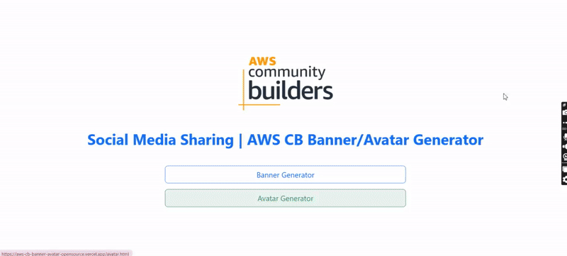

# aws-cb-announcement-avatar-opensource
This project is an open-source web tool designed for AWS Community Builders to generate personalized announcement banners. Users can upload their headshot, enter their name, role, and cohort details, and instantly create a polished banner featuring the official AWS CB branding. The generated image is optimized for sharing on social platforms like LinkedIn, Twitter, and Instagram to celebrate their achievement and increase community visibility.

<!--  -->

# Cropper.js
https://github.com/fengyuanchen/cropperjs/blob/main/README.md

# JQuery Cropper
https://github.com/fengyuanchen/jquery-cropper